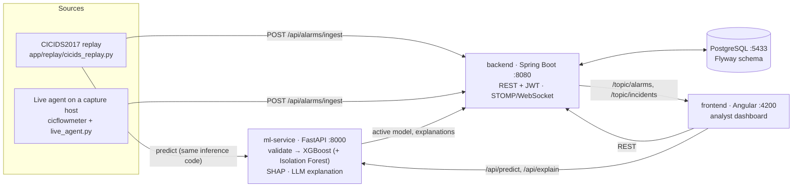

# ML-based Network Intrusion Detection System

A full-stack intrusion detection system (IDS) built as a diploma project. It classifies
network flows with machine-learning models trained on CICIDS2017. It raises and correlates
alarms, explains detections with SHAP and an optional LLM, and shows everything in a
real-time analyst dashboard. The repository also holds the experiments behind the thesis:
benchmark training, generalization tests, and a controlled lab evaluation.

> Research prototype. It has been evaluated on a public dataset and in a small isolated lab,
> not in production. The dashboard and service messages are in Albanian.

## 1. What it does and who uses it

- **Detects attacks in flow records.** Each flow is described by CICFlowMeter statistics
  (packet sizes, inter-arrival times, flags, …). An XGBoost classifier labels it `BENIGN` or
  one of 14 CICIDS2017 attack classes. An optional Isolation Forest flags flows the
  classifier calls benign but that look unusual; these appear as `UNKNOWN`.
- **Turns detections into work items.** Every attack or `UNKNOWN` flow becomes an alarm.
  Alarms are grouped into incidents by source IP and attack type within a time window
  (120 s by default), then pushed live to the dashboard.
- **Users:**
  - **Analysts** triage alarms and incidents, inspect a flow's top SHAP features, request
    an LLM explanation, and record false-positive feedback.
  - **Admins** also manage users, the active model and severity thresholds.
  - A **service** account is used by the scripts that feed flows in.

## 2. Architecture



**From a flow to the dashboard:**

1. **Flow features.** CICFlowMeter turns packets into one row of flow statistics. The
   replay script takes that row from the CICIDS2017 dataset. The live agent reads it from
   `cicflowmeter` running on a separate Linux capture host.
2. **Prediction.** The feature vector is checked against the model's feature schema:
   names, order, and finite values. A mismatch is rejected, never silently zero-filled.
   The active XGBoost model then predicts a class and a confidence. If the classifier says
   `BENIGN` but the Isolation Forest scores the flow as anomalous, the result is
   `UNKNOWN`. The replay script runs the ml-service inference code in-process; the live
   agent loads its own copy of the model.
3. **Alert.** The result goes to `POST /api/alarms/ingest` on the backend, which stores the
   flow together with the model identity and version. For an attack or `UNKNOWN` it also
   creates an alarm. Severity comes from confidence thresholds (anomalies get a fixed
   severity). The alarm is attached to an open incident or starts a new one.
4. **Dashboard view.** The backend broadcasts the alarm and incident over
   STOMP/WebSocket, so the Angular dashboard updates live. When an analyst opens an alarm,
   the dashboard asks ml-service for the flow's SHAP contributions. It can also ask for a
   natural-language explanation: ml-service sends the prediction and top SHAP features to
   Claude and stores the text back through the backend.

The backend and ml-service APIs require a JWT (HS256), so both services must share the
same `IDS_JWT_SECRET`.

**Which model the app runs.** ml-service serves the XGBoost model marked active in the
backend's model registry. On a fresh setup the registry is empty, so it falls back to the
shipped `xgb_smote_top50features_v1` (CICIDS2017, 50 features). Dashboard predictions
always come from that multiclass CICIDS2017 model, never from the research-only Model B
described below.

## 3. Data and methods

### Benchmark models (CICIDS2017)

| Step | What was done |
|---|---|
| Data | The 8 labelled CICIDS2017 CSV files (`TrafficLabelling`), extracted by the original Java CICFlowMeter. 78 numeric features, 15 classes. |
| Cleaning | Strip column names, drop the duplicated `Fwd Header Length.1`, turn ±inf into NaN, and drop rows with no `Flow Bytes/s` / `Flow Packets/s`. This leaves 2,827,876 rows (`app/ml/data_loading.py`). |
| Split | Stratified random 80/20 split, `random_state=42`: 2,262,300 training and 565,576 test rows. The split happens before any resampling, and code asserts that train and test don't overlap. |
| Balancing | Training rows only. BENIGN is undersampled to 200,000, and attack classes under 2,000 rows are raised to 2,000 with SMOTE, giving 653,897 rows. "Baseline" models skip this step. |
| Models | XGBoost and Random Forest, each with and without balancing, plus an MLP with balancing (the only model with a scaler, fitted on training data only). XGBoost was also trained on the top 10/20/30/50 features ranked by training-only gain. |
| Evaluation | Primary metric: macro F1 over all 15 classes. Also reported: macro F1 over classes with ≥ 100 test rows, per-class metrics, benign false-positive rate, and latency. Every metric is recomputed from the saved model and validated before it can be registered. |
| Generalization tests | (a) **Temporal split:** train on earlier traffic, test on later traffic. (b) **Leave-one-family-out:** remove one attack family from training entirely. (c) **Live lab:** replay attacks from Kali against Metasploitable2 on an isolated network and score the frozen model on them. |

Pipeline code: `ml-service/training/` (see its [README](ml-service/training/README.md)).
Configs: `ml-service/training/configs/`.

### Research follow-up: deployment-adapted "Model B" (not used by the app)

Model B exists only in the offline evaluation scripts and reports. ml-service never loads
it, and it uses a different feature schema. The lab test showed the benchmark model ("Model A", `xgb-baseline-cicids2017-v2`) almost
never flagged lab attacks. As a follow-up, a separate **binary** detector (BENIGN vs
ATTACK) was trained on lab traffic:

- **Features:** 76 features from the Python `cicflowmeter 0.5.0` extractor, which is also
  the one used in deployment. They are *not* converted to the CICIDS2017 schema.
- **Data:** 9 lab runs for training (24,726 labelled flows, 94.8 % of attacks are
  PortScan). 3 earlier lab runs serve as development validation. 9 new runs were
  captured and sealed as the final test set before any prediction was made. Splits are
  by whole run, never by individual flow.
- **Method:** XGBoost with inverse-frequency class weights computed on training data only;
  no SMOTE. The decision threshold of 0.50 was fixed in advance. A Random Forest
  (robustness check) and an unweighted XGBoost (ablation) were trained alongside. The
  primary model was fixed before training and was not swapped for whichever model
  validated best.

## 4. Main findings and limitations

**Benchmark: CICIDS2017, stratified random split, 565,576 test flows**
([source](ml-service/reports/training/)):

| Model (v2) | Macro F1 (15 classes) | Macro F1 (classes ≥ 100 rows) | Accuracy |
|---|---:|---:|---:|
| XGBoost, no balancing | **0.8806** | 0.9091 | 0.9990 |
| XGBoost, balanced | 0.8773 | **0.9138** | 0.9988 |
| Random Forest, no balancing | 0.8709 | 0.9114 | 0.9987 |
| Random Forest, balanced | 0.8646 | 0.9085 | 0.9985 |
| MLP, balanced | 0.7252 | 0.8086 | 0.9898 |

XGBoost with only its top 50 features reaches 0.8804 macro F1. With the top 10 it drops
to 0.6925. The app's fallback model (`xgb_smote_top50features_v1`, an earlier training of
the top-50 XGBoost) scores 0.8794 / 0.9194 / 0.9988 on the same test split
([source](ml-service/reports/artifact_evaluation/xgb_smote_top50features_v1/metrics.json)).

**How far the benchmark figures generalize:**

- **Temporal split, controlled XGBoost**
  ([EVALUATION §6](docs/EVALUATION.md#6-how-optimistic-is-the-random-split--random-vs-temporal)).
  The random split is optimistic. Keep each class's test size the same but hold out its
  *latest* 20 % instead: macro F1 falls from 0.8614 to 0.7818, and the benign
  false-positive rate rises from 0.10 % to 2.58 %.
- **Unseen attack families (leave-one-family-out, v2 models)**
  ([source](ml-service/reports/lofo_evaluation/aggregate.json)). Detection is close to
  zero when a family was never seen in training: PortScan ≤ 0.9 %, Bot 0 %, DoS ≤ 3.8 %,
  Brute Force ≤ 7.7 %. It is higher only for DDoS (51–63 %) and Web Attack (4–66 %).
  No zero-day capability is claimed.
- **Live lab, frozen Model A**
  ([source](ml-service/reports/live_evaluation/aggregate.json)). 0 false positives in
  5,407 benign flows, but only 2 of 1,362 PortScan flows and 0 of 69 SSH brute-force
  flows were detected. A source-code audit links the shift partly to differences between
  the Java CICFlowMeter used for CICIDS2017 and the Python `cicflowmeter` used in the lab.
  The size of that effect could not be measured directly.

**Model B research evaluation.** Lab traffic only, binary detection, threshold 0.50. These
results do not describe the model behind the dashboard.

| Scenario | Development validation (3 runs) | Final sealed test (9 new runs) | Model A on the same final flows |
|---|---|---|---|
| PortScan detected | 1,362 / 1,362 | 1,179,630 / 1,179,630 | 0 / 1,179,630 |
| SSH detected | 67 / 69 | **0 / 180** | 0 / 180 |
| Benign false positives | 21 / 5,407 (0.39 %) | **85 / 960 (8.85 %)** | 0 / 960 |

Sources: [training & validation results](ml-service/reports/domain_adaptation/phase17c/RESULTS.md),
[final evaluation results](ml-service/reports/domain_adaptation/phase17d/RESULTS.md).

In the final test, Model B reliably detects lab port scans, but at a much higher benign
false-positive rate than validation suggested. The SSH result is confounded: the final SSH
traffic had to be generated with a different procedure (banner exchanges instead of full
login attempts), so it is not a clean generalization test.

**LLM explanations**
([results](ml-service/reports/domain_adaptation/phase17d/llm_explainability/RESULTS.md)).
This was evaluated offline on 12 fixed Model B alerts from the final test, each explained
with and without SHAP. All 24 Claude responses stated the correct model decision, and
none referenced facts absent from the evidence. No human evaluation was done, so
usefulness to analysts is untested.

**Limitations:**

- Macro F1 on CICIDS2017 is unstable. Heartbleed, Infiltration and SQL Injection have
  2, 7 and 4 test rows.
- The lab is one isolated topology with two hosts and a few attack types.
- Model B's training attacks are mostly port scans.
- The Java-vs-Python extractor effect has not been isolated, because the raw CICIDS2017
  PCAPs were never re-extracted.

## 5. Running locally

**Prerequisites** (versions verified here): Docker, Java 17 + Maven 3.9, Python 3.11,
Node.js 24 + npm 11. The backend has no Maven wrapper, so Maven must be installed.

### 1) Database

```bash
cd backend
docker compose up -d          # PostgreSQL 16 on localhost:5433, db "IDS", user/password postgres
```

### 2) Backend (Spring Boot, :8080)

Flyway creates the schema on first start. The backend reads its settings from environment
variables. Choose your own values:

```bash
export IDS_JWT_SECRET="change-me-to-a-random-string-of-32+-bytes"   # shared with ml-service
export IDS_ADMIN_PASSWORD="choose-an-admin-password"                 # dashboard login: admin
export IDS_SERVICE_PASSWORD="choose-a-service-password"              # used by ml-service scripts
cd backend
mvn spring-boot:run
```

The `admin` and `ml-service` users are created on the first start only. If a password
variable is empty, a random password is generated and printed once in the log. If
`IDS_JWT_SECRET` is empty, a temporary key is used and ml-service can't verify tokens.
PowerShell uses `$env:IDS_JWT_SECRET = "..."` instead of `export`.

### 3) ML service (FastAPI, :8000)

```bash
cd ml-service
python -m venv .venv && source .venv/bin/activate      # Windows: .venv\Scripts\activate
pip install -r requirements.txt
cp .env.example .env    # set IDS_JWT_SECRET and SPRING_SERVICE_PASSWORD to the values above
                        # optional: ANTHROPIC_API_KEY for LLM explanations
cp app/replay/xgb_smote_top50features_v1.joblib app/replay/label_encoder_cicids2017.joblib models/
uvicorn app.main:app --port 8000
```

Model binaries (`*.joblib`) are not stored in `models/` (they are gitignored). The copy
step above installs the one XGBoost model that ships in the repository. ml-service falls
back to it when no model is registered as active in the backend. Check that the service
is up with `curl localhost:8000/health`.

### 4) Frontend (Angular, :4200)

```bash
cd frontend
npm ci
npm start               # http://localhost:4200, log in as admin
```

### 5) Send traffic through the pipeline

The dashboard stays empty until flows arrive. To replay labelled CICIDS2017 flows, first
build the dataset as described under **Not included** below, then run:

```bash
cd ml-service
python -m app.replay.cicids_replay --limit 500 --rate 10    # --dry-run predicts without sending
```

The live agent (`app/replay/live_agent.py`) needs a Linux host running `cicflowmeter` and
is only needed for lab capture.

### Tests

```bash
cd ml-service && pytest
cd backend && mvn test                      # needs the PostgreSQL container running
cd frontend && npm test -- --watch=false
```

Tests that need the dataset or a locally trained model skip when it is missing. Tests of
the model files shipped in `app/replay/` always run.

Some tests re-hash committed evidence files. Those hashes were recorded from specific line
endings, so `.gitattributes` pins the line endings of those files. A fresh clone therefore
passes the hash checks on any platform and with any `core.autocrlf` setting.

### Not included / separate setup

| Item | How to get it |
|---|---|
| CICIDS2017 CSVs | Download the labelled flow CSVs ([CIC-IDS2017](https://www.unb.ca/cic/datasets/ids-2017.html)) and put the 8 `*.pcap_ISCX.csv` files in `ml-service/datasets/TrafficLabelling/`. |
| `cicids2017_cleaned.parquet` | Needed for replay, training and dataset-based tests. From `ml-service/`, run `python -c "from app.ml.data_loading import load_all_cicids2017 as f; f('datasets/TrafficLabelling').to_parquet('datasets/cicids2017_cleaned.parquet')"`. With the pinned requirements this reproduces the SHA-256 recorded in the reports (`f5b393d6…3d1d`, 2,827,876 rows). |
| Trained benchmark models | Not in git. Retrain with `python -m training.train training/configs/<config>.yaml` (needs the parquet). Their metadata, feature lists and metrics are committed in `ml-service/models/*.json` and `ml-service/reports/`. |
| Isolation Forest (hybrid `UNKNOWN` detection) | Not in git. Build with `python -m training.build_anomaly_detector` (needs the parquet). Without it, ml-service runs supervised-only. |
| Model B artifacts | Not in git. `python training/train_model_b.py` retrains them from the committed lab flow CSVs; the SHA-256 hashes recorded in the reports reproduce exactly. |
| Raw lab PCAPs and final-test flow CSVs | Kept outside git because of size; their hashes are recorded in the manifests under `ml-service/reports/domain_adaptation/`. |

## Further reading

- [Experimental protocol](docs/EXPERIMENTAL_PROTOCOL.md): frozen splits, metrics, and the
  temporal, leave-one-family-out and lab protocols
- [Evaluation write-up](docs/EVALUATION.md): hybrid detector, random vs temporal,
  unsupported classes, LLM grounding
- [Training pipeline](ml-service/training/README.md): reproducible training, balancing
  recipe, experiment registration
- [Feature compatibility](docs/FEATURE_COMPATIBILITY.md): CICFlowMeter vs CICIDS2017
  feature mapping
- Model B: [design](ml-service/reports/domain_adaptation/README.md),
  [training protocol](ml-service/reports/domain_adaptation/phase17c/PROTOCOL.md),
  [final evaluation protocol](ml-service/reports/domain_adaptation/phase17d/PROTOCOL.md),
  [threats to validity](ml-service/reports/domain_adaptation/threats_to_validity.md)
- [Initial architecture audit](docs/IDS_ARCHITECTURE_AUDIT.md) (historical snapshot)
